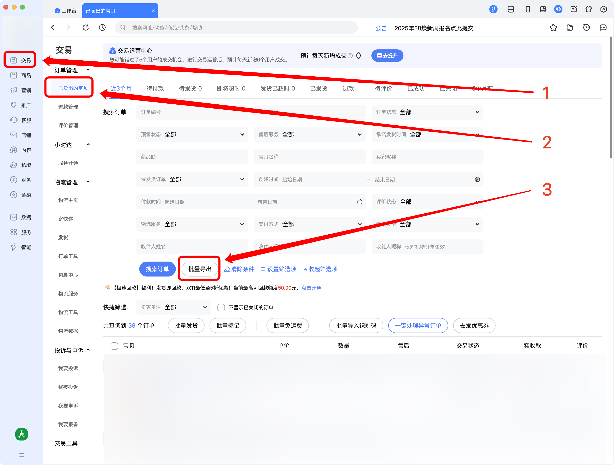
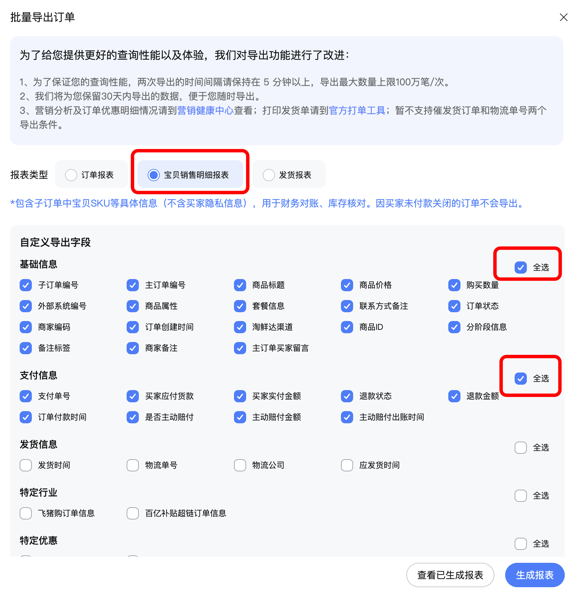
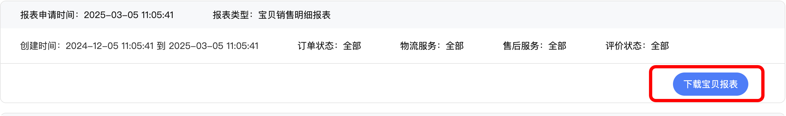
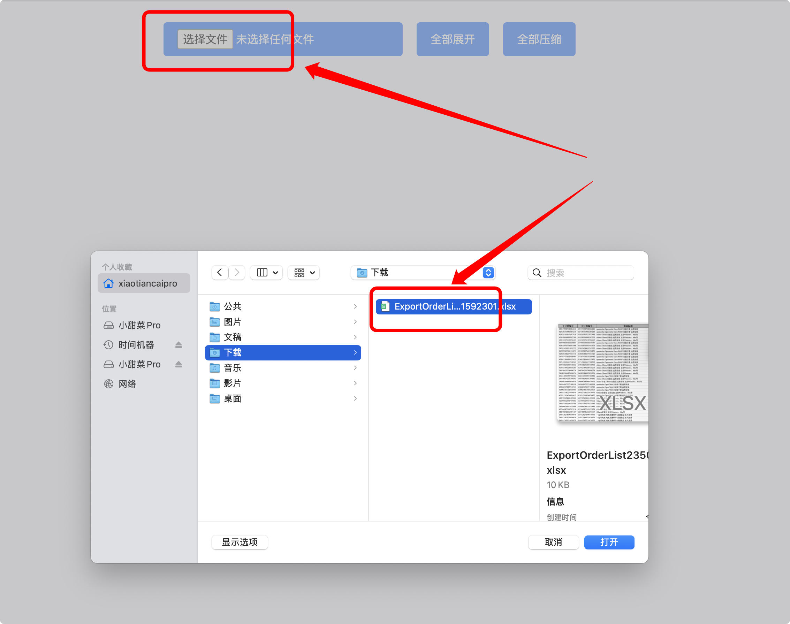
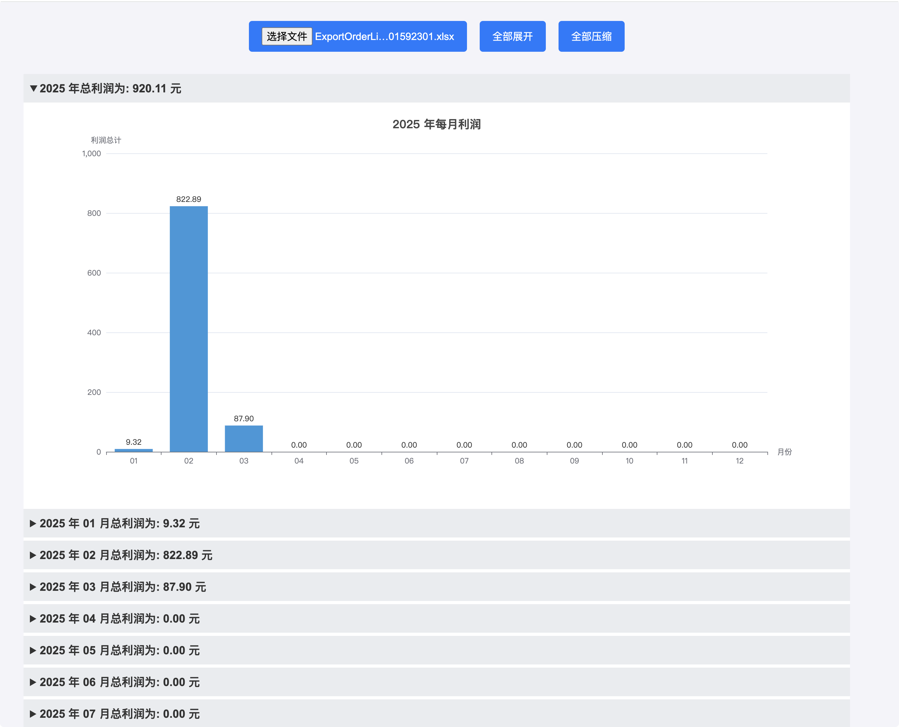

# 淘宝账单分析，利润分析


## 一、介绍

该项目用于淘宝账单分析，可以方便的查看每年、每月、每日的利润。


## 二、使用教程

1. 构建 Docker 镜像
   ```bash
   docker build -t taobao-bill-analysis .
   ```

2. 启动
   ```bash
   docker run -d -p 9926:80 --name taobao-bill-analysis taobao-bill-analysis
   ```
   或者
   ```bash
   docker compose -p taobao-bill-analysis up -d
   ```

3. 进入千牛将账单导出
   
   
   

4. 进入项目进行图表展示
   
   

